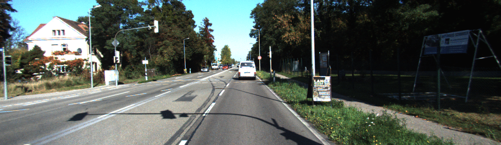
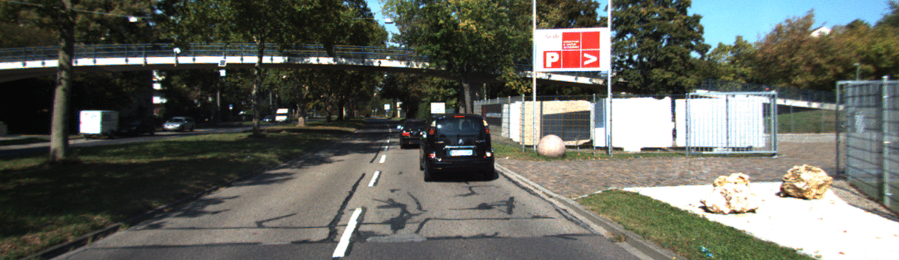

# Single-Image Adversarial Depth Estimation Model

Keras implementation of the proposed single-image adversarial depth estimation model.

  

  

## Requirements
The code was run on Keras 2.2.0, Tensorflow 1.8.0 and Ubuntu 16.04. Matplotlib 2.2.2 was used for visualizing the various model outputs.

## Training
The model was trained on the depth prediction split of the KITTI dataset (http://www.cvlibs.net/datasets/kitti/eval_depth.php?benchmark=depth_prediction). You can download the pre-trained models for each generator network in the links below:
* Autoencoder generator: TBD
* DenseNet generator: TBD

